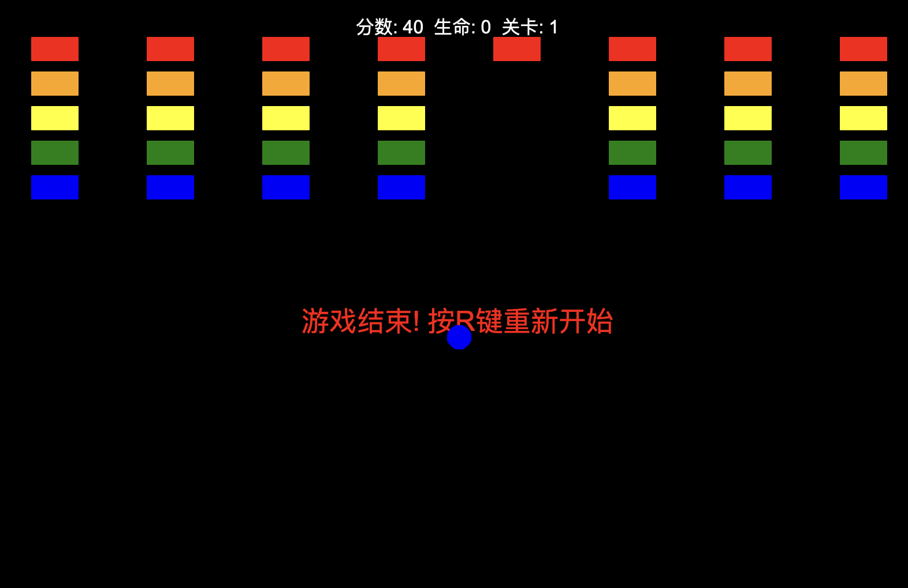

# Colorful pinball game 🎮

This is an interesting colored pinball game developed using Python and the Turtle graphics library. The game combines the classic brick-breaking gameplay and adds cool particle effects and color changes, making the gaming experience more colorful and diverse.

## operational approach

- Use the left and right arrow keys or the A/D key to control the left and right movement of the baffle
- Hitting a brick earns points
- A life will be lost if the ball lands
- Press the R key to start over after the game ends

## game rule

1. The initial health points are 3
2. 10 points are awarded for each brick broken
3. There is a 10% chance of generating new bouncy balls (up to 3) when hitting a brick
4. When all the bricks are smashed, it automatically enters the next level
5. The game ends when health points are exhausted

## technical feature

- Build using the turtle graphics library of Python
## technical feature

Have a great time! 🎮✨